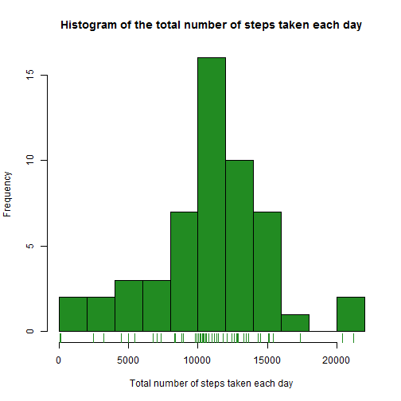
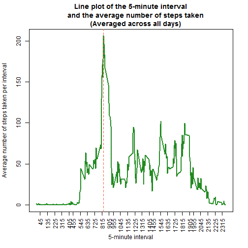
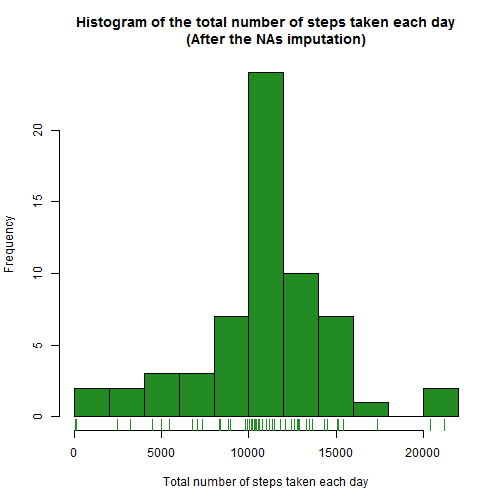
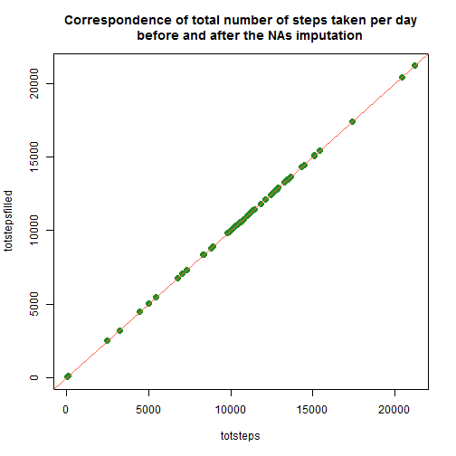
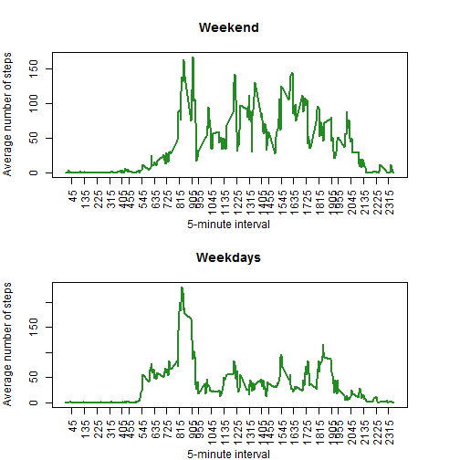

# Reproducible Research: Peer Assessment 1
*by Francesco Giovinazzi* [Italy]
## Loading and preprocessing the data
I have loaded the dataset in .csv format and named it `activity`. Then I applied a transformation to the `date` variable in order to change its class from `factor` to `Date`. I used the function `str` to show the structure of the transformed dataset.

```r
activity <- read.csv("activity.csv", header=TRUE, sep=",")
activity$date <- as.Date(activity$date)
str(activity)
```

```
## 'data.frame':	17568 obs. of  3 variables:
##  $ steps   : int  NA NA NA NA NA NA NA NA NA NA ...
##  $ date    : Date, format: "2012-10-01" "2012-10-01" ...
##  $ interval: int  0 5 10 15 20 25 30 35 40 45 ...
```

## What is mean total number of steps taken per day?
I have calculated the total number of steps taken per day using the function `tapply` to iterate the function `sum` on the number of steps through each day.

```r
totsteps <- with(activity, tapply(steps, date, sum))
totsteps
```

```
## 2012-10-01 2012-10-02 2012-10-03 2012-10-04 2012-10-05 2012-10-06 
##         NA        126      11352      12116      13294      15420 
## 2012-10-07 2012-10-08 2012-10-09 2012-10-10 2012-10-11 2012-10-12 
##      11015         NA      12811       9900      10304      17382 
## 2012-10-13 2012-10-14 2012-10-15 2012-10-16 2012-10-17 2012-10-18 
##      12426      15098      10139      15084      13452      10056 
## 2012-10-19 2012-10-20 2012-10-21 2012-10-22 2012-10-23 2012-10-24 
##      11829      10395       8821      13460       8918       8355 
## 2012-10-25 2012-10-26 2012-10-27 2012-10-28 2012-10-29 2012-10-30 
##       2492       6778      10119      11458       5018       9819 
## 2012-10-31 2012-11-01 2012-11-02 2012-11-03 2012-11-04 2012-11-05 
##      15414         NA      10600      10571         NA      10439 
## 2012-11-06 2012-11-07 2012-11-08 2012-11-09 2012-11-10 2012-11-11 
##       8334      12883       3219         NA         NA      12608 
## 2012-11-12 2012-11-13 2012-11-14 2012-11-15 2012-11-16 2012-11-17 
##      10765       7336         NA         41       5441      14339 
## 2012-11-18 2012-11-19 2012-11-20 2012-11-21 2012-11-22 2012-11-23 
##      15110       8841       4472      12787      20427      21194 
## 2012-11-24 2012-11-25 2012-11-26 2012-11-27 2012-11-28 2012-11-29 
##      14478      11834      11162      13646      10183       7047 
## 2012-11-30 
##         NA
```

I have rapresented the variable `totsteps` with a histogram.

```r
hist(totsteps, breaks = 10, col="forestgreen", 
     main="Histogram of the total number of steps taken each day", 
     xlab="Total number of steps taken each day")
rug(totsteps, col="forestgreen")
```

 

I have calculated the mean and median total number of steps taken per day, ignoring the NAs.

```r
measteps <- mean(totsteps, na.rm=TRUE)
measteps
```

```
## [1] 10766
```

```r
medsteps <- median(totsteps, na.rm=TRUE)
medsteps
```

```
## [1] 10765
```
The mean total number of steps taken per day is 1.0766 &times; 10<sup>4</sup>, while the median total number of steps taken per day is 10765.


## What is the average daily activity pattern?
In order to make a time series plot of the 5-minute interval and the average number of steps taken, I have created a variable, named `interfac`, that contains all the possible values of the variabile `interval` (the values of `interfac` are the levels of `interval`) and that identifies unambiguously each 5-minutes interval.
Along the levels of `interval`I have then calculated the average number of steps. The variabile `avdsteps` contains the mean number of steps taken into a certain interval avereged accross all days.


```r
interfac <- as.numeric(names(table(activity$interval)))
avdsteps <- with(activity, aggregate(steps, by=list(interval), FUN = mean, na.rm=TRUE))[[2]]
```

Using the base plotting system, I have rapresented as a line plot the average number of steps taken in each interval averaged accross all days.


```r
plot(interfac, avdsteps, type="l", col="forestgreen", lwd=2,
     main = "Line plot of the 5-minute interval
     and the average number of steps taken
     (Averaged across all days)",
     xlab ="5-minute interval", xaxt='n',
     ylab ="Average number of steps taken per interval")
axis(1, at = interfac[seq(0, length(interfac), by=10)], las=2, cex=0.03)
maxint <- interfac[which(avdsteps==max(avdsteps))]
maxint
```

```
## [1] 835
```

```r
abline(v=maxint, col="tomato", lty=2)
```

 


We can see that there is a peak between the intervals 800 and 900, so I calculated the interval corresponding to the maximum number of steps and traced a red line in corrispondence. This interval is the 835.
 
## Imputing missing values

I have calculated the total number of missing observations in the dataset. In order to get the total number of rows containing at least one NA, I used the function `is.na` that returns a matrix of `TRUE` and `FALSE` (`TRUE` corresponds to NA), then I have made the sum on each row and counted how many row had values different from 0 (a row with 0 TRUE is a complete observation, without NA). In our case we could have used simple the function `sum(is.na(activity))` because the NAs are only in one column. 


```r
rowNA <- sum(rowSums(is.na(activity))!=0)
rowNA
```

```
## [1] 2304
```

The number of NAs is 2304. In order to understand better the structure of missing values, I studied the dataset `activity[is.na(activity),]`, containing only the rows with NAs. I verified that all the 2304 missing values are in the first column (the variable `steps`), I noticed also that in this sub-dataset we have observation for 8 days (looking at the table of `date`) and 288 intervals for each day (looking at the table of `interval`). This information will turn out to be very useful in the definition of an imputation strategy. 


```r
sum(is.na(activity[is.na(activity),]$steps))
```

```
## [1] 2304
```

```r
table(activity[is.na(activity),]$date)
```

```
## 
## 2012-10-01 2012-10-08 2012-11-01 2012-11-04 2012-11-09 2012-11-10 
##        288        288        288        288        288        288 
## 2012-11-14 2012-11-30 
##        288        288
```

```r
table(activity[is.na(activity),]$interval)
```

```
## 
##    0    5   10   15   20   25   30   35   40   45   50   55  100  105  110 
##    8    8    8    8    8    8    8    8    8    8    8    8    8    8    8 
##  115  120  125  130  135  140  145  150  155  200  205  210  215  220  225 
##    8    8    8    8    8    8    8    8    8    8    8    8    8    8    8 
##  230  235  240  245  250  255  300  305  310  315  320  325  330  335  340 
##    8    8    8    8    8    8    8    8    8    8    8    8    8    8    8 
##  345  350  355  400  405  410  415  420  425  430  435  440  445  450  455 
##    8    8    8    8    8    8    8    8    8    8    8    8    8    8    8 
##  500  505  510  515  520  525  530  535  540  545  550  555  600  605  610 
##    8    8    8    8    8    8    8    8    8    8    8    8    8    8    8 
##  615  620  625  630  635  640  645  650  655  700  705  710  715  720  725 
##    8    8    8    8    8    8    8    8    8    8    8    8    8    8    8 
##  730  735  740  745  750  755  800  805  810  815  820  825  830  835  840 
##    8    8    8    8    8    8    8    8    8    8    8    8    8    8    8 
##  845  850  855  900  905  910  915  920  925  930  935  940  945  950  955 
##    8    8    8    8    8    8    8    8    8    8    8    8    8    8    8 
## 1000 1005 1010 1015 1020 1025 1030 1035 1040 1045 1050 1055 1100 1105 1110 
##    8    8    8    8    8    8    8    8    8    8    8    8    8    8    8 
## 1115 1120 1125 1130 1135 1140 1145 1150 1155 1200 1205 1210 1215 1220 1225 
##    8    8    8    8    8    8    8    8    8    8    8    8    8    8    8 
## 1230 1235 1240 1245 1250 1255 1300 1305 1310 1315 1320 1325 1330 1335 1340 
##    8    8    8    8    8    8    8    8    8    8    8    8    8    8    8 
## 1345 1350 1355 1400 1405 1410 1415 1420 1425 1430 1435 1440 1445 1450 1455 
##    8    8    8    8    8    8    8    8    8    8    8    8    8    8    8 
## 1500 1505 1510 1515 1520 1525 1530 1535 1540 1545 1550 1555 1600 1605 1610 
##    8    8    8    8    8    8    8    8    8    8    8    8    8    8    8 
## 1615 1620 1625 1630 1635 1640 1645 1650 1655 1700 1705 1710 1715 1720 1725 
##    8    8    8    8    8    8    8    8    8    8    8    8    8    8    8 
## 1730 1735 1740 1745 1750 1755 1800 1805 1810 1815 1820 1825 1830 1835 1840 
##    8    8    8    8    8    8    8    8    8    8    8    8    8    8    8 
## 1845 1850 1855 1900 1905 1910 1915 1920 1925 1930 1935 1940 1945 1950 1955 
##    8    8    8    8    8    8    8    8    8    8    8    8    8    8    8 
## 2000 2005 2010 2015 2020 2025 2030 2035 2040 2045 2050 2055 2100 2105 2110 
##    8    8    8    8    8    8    8    8    8    8    8    8    8    8    8 
## 2115 2120 2125 2130 2135 2140 2145 2150 2155 2200 2205 2210 2215 2220 2225 
##    8    8    8    8    8    8    8    8    8    8    8    8    8    8    8 
## 2230 2235 2240 2245 2250 2255 2300 2305 2310 2315 2320 2325 2330 2335 2340 
##    8    8    8    8    8    8    8    8    8    8    8    8    8    8    8 
## 2345 2350 2355 
##    8    8    8
```

```r
length(table(activity[is.na(activity),]$interval))
```

```
## [1] 288
```

I have created the dataset `activityfilled` as a copy of `activity`, then I have selected only the rows containing the NAs `activityfilled[is.na(activityfilled),]` and the column corresponding to the variable `steps`. I have decided to replace the missing values in `steps` with the average number of steps taken into a certain 5-minutes interval, for this reason a I have repeated 8 times (using the function `rep`) the variable `avdsteps` (rounded without decimals). 


```r
activityfilled <- activity
activityfilled[is.na(activityfilled),]$steps <- rep(round(avdsteps),8)

sum(is.na(activityfilled))
```

```
## [1] 0
```

`avdsteps` has 288 elements (one per interval), and in each of the 8 days we have exactly 288 intervals, so  288 $\times$ 8 = 2304. After the imputation I have verified that the dataset has no more NAs.


In order to see if tthe imputation has changed something in the data structure, I have made a new histogram and calculated again the mean and median total number of steps taken per day.


```r
totstepsfilled <- with(activityfilled, tapply(steps, date, sum))
hist(totstepsfilled, breaks = 10, col="forestgreen", 
     main="Histogram of the total number of steps taken each day
     (After the NAs imputation)", 
     xlab="Total number of steps taken each day")
rug(totsteps, col="forestgreen")
```

 

From the histogram we can see that the distribution appears to be more concentrated around the mean, there is less variability and the central column is higher then before the imputation. By the way, the overall shape of the graphic is not changed so much. This is obbvious because we have replaced missing values with mean values, enhancing the central tendency. 


```r
meastepsfilled <- mean(totstepsfilled, na.rm=TRUE)
meastepsfilled
```

```
## [1] 10766
```

```r
medstepsfilled <- median(totstepsfilled, na.rm=TRUE)
medstepsfilled
```

```
## [1] 10762
```

Looking at the new values of mean and median we can gather the same conclusions: 
- the mean is 1.0766 &times; 10<sup>4</sup> and it is not changed at all, this because (adding values near the mean) we have strenghtened the concentration toward the average;
- the median is 1.0762 &times; 10<sup>4</sup> and it is decreased in value (before the imputation it was 10765). This appened because (adding values near the mean) we have caused higher values to be less impacting on the definition of the second quartile.


After the imputation, the total number of steps taken per day is not changed at all, there is perfect correspondence between the values of `totsteps` and `totstepsfilled`. We can verify this noticing that the difference between the two values is always 0 or, using a simple plot, that the points are located along the bisector line (with eqation $Y = X$).


```r
totstepsfilled - totsteps
```

```
## 2012-10-01 2012-10-02 2012-10-03 2012-10-04 2012-10-05 2012-10-06 
##         NA          0          0          0          0          0 
## 2012-10-07 2012-10-08 2012-10-09 2012-10-10 2012-10-11 2012-10-12 
##          0         NA          0          0          0          0 
## 2012-10-13 2012-10-14 2012-10-15 2012-10-16 2012-10-17 2012-10-18 
##          0          0          0          0          0          0 
## 2012-10-19 2012-10-20 2012-10-21 2012-10-22 2012-10-23 2012-10-24 
##          0          0          0          0          0          0 
## 2012-10-25 2012-10-26 2012-10-27 2012-10-28 2012-10-29 2012-10-30 
##          0          0          0          0          0          0 
## 2012-10-31 2012-11-01 2012-11-02 2012-11-03 2012-11-04 2012-11-05 
##          0         NA          0          0         NA          0 
## 2012-11-06 2012-11-07 2012-11-08 2012-11-09 2012-11-10 2012-11-11 
##          0          0          0         NA         NA          0 
## 2012-11-12 2012-11-13 2012-11-14 2012-11-15 2012-11-16 2012-11-17 
##          0          0         NA          0          0          0 
## 2012-11-18 2012-11-19 2012-11-20 2012-11-21 2012-11-22 2012-11-23 
##          0          0          0          0          0          0 
## 2012-11-24 2012-11-25 2012-11-26 2012-11-27 2012-11-28 2012-11-29 
##          0          0          0          0          0          0 
## 2012-11-30 
##         NA
```

```r
plot(totsteps,totstepsfilled, pch=19, cex = 1.3, col="forestgreen",
     main = "Correspondence of total number of steps taken per day
     before and after the NAs imputation")
abline(a=0, b=1, col= "tomato")
```

 

## Are there differences in activity patterns between weekdays and weekends?
Using the `vector` function I have created a new empty variable in the dataset `activityfilled` and named it `weekpart`. The variable `weekpart` should be a factor with two levels - "weekday" and "weekend" indicating whether a given date is a weekday or weekend day.

To fill in the values of this variable I implemented a for loop with 17568 iterations. At each iteration R verifies an if condition:
- if the i-th value of `date` (after applying the function `weekdays`) is sunday (*domenica* in Italian) or saturday (*sabato* in Italian), the i-th value of `weekpart` is assigned to be "weekend";
- if the i-th value of `date` (after applying the function `weekdays`) is any other day of the week, the i-th value of `weekpart` is assigned to be "weekday".  


```r
activityfilled$weekpart <- vector("character", length(activityfilled$steps)) 
for (i in 1:length(activityfilled$weekpart)){
  if (weekdays(activityfilled$date[i]) == "domenica" | weekdays(activityfilled$date[i]) == "sabato"){
    activityfilled$weekpart[i] <- "weekend"
  } else {
    activityfilled$weekpart[i] <- "weekday"
  }
}

table(activityfilled$weekpart)
```

```
## 
## weekday weekend 
##   12960    4608
```
In the dataset we have 12960 observations for the weekdays and 4608 for the weekend days.  


Using the base plotting system, I have made a panel visualization containing the two line plot of the 5-minute interval and the average number of steps taken, averaged across all weekday days or weekend days. So I have calculated the needed values (`interfacfilledwe`, `avdstepsfilledwe`, `interfacfilledwd`, `avdstepsfilledwd`),  separately for the weekend and weekday, and plotted the two time series.


```r
interfacfilledwe <- with(activityfilled[activityfilled$weekpart=="weekend",], 
                         as.numeric(names(table(interval))))
avdstepsfilledwe <- with(activityfilled[activityfilled$weekpart=="weekend",], 
                         aggregate(steps, by=list(interval), FUN = mean))[[2]]

interfacfilledwd <- with(activityfilled[activityfilled$weekpart=="weekday",], 
                         as.numeric(names(table(interval))))
avdstepsfilledwd <- with(activityfilled[activityfilled$weekpart=="weekday",], 
                         aggregate(steps, by=list(interval), FUN = mean))[[2]]

par(mfrow=c(2,1), mar=c(4,4,4,4))
plot(interfacfilledwe, avdstepsfilledwe, type="l", col="forestgreen", lwd=2,
     main = "Weekend",
     xlab ="5-minute interval", xaxt='n',
     ylab ="Average number of steps")
axis(1, at = interfacfilledwe[seq(0, length(interfacfilledwe), by=10)], las=2, cex=0.03)
plot(interfacfilledwd, avdstepsfilledwd, type="l", col="forestgreen", lwd=2,
     main = "Weekdays",
     xlab ="5-minute interval", xaxt='n',
     ylab ="Average number of steps")
axis(1, at = interfacfilledwd[seq(0, length(interfacfilledwd), by=10)], las=2, cex=0.03)
```

 

**We can see that after the interval 905 the average number of steps is consistently higher during the weekend  than during the week.**

